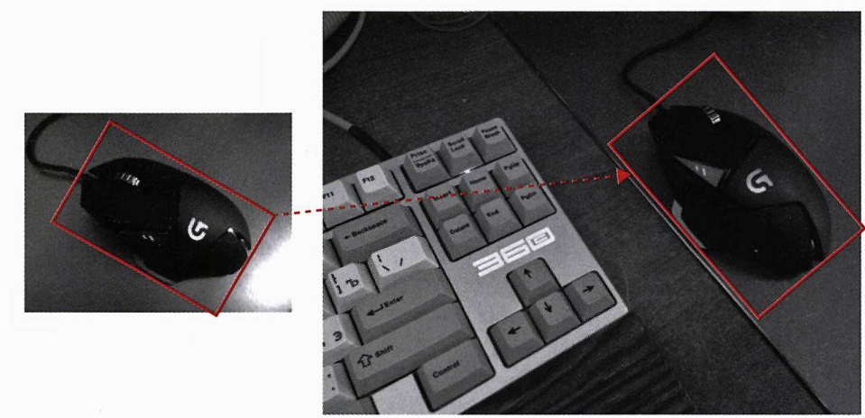

# Chapter 08: 불변 특징의 표현과 정합 (8.1~8.2) - 작성자: 고형주

<aside>

### 💡 학습목표

- 영상 정합의 개념을 이해한다.
- SIFT 알고리즘의 개념을 이해한다.
- SURF 알고리즘의 개념을 이해한다.
- 영상 정합을 위한 특징점 매칭 방법을 공부한다.
</aside>

<aside>

### 🗒️ 프리뷰

앞 장에서 설명한 바와 같이, 입력 영상으로부터 경계선, 코너첨과 같은 기하학적 특징과 분산 히스토그램과 같은 통계적 특징을 얻을 수 있다. 이러한 특징은 영상의 객체를 표현하는 파라미터로 사용할 수 있다. 이 특징 파라미터값을 이용하여 수치 또는 구조 등을 비교함으로써 객체의 형태를 컴퓨터와 같은 장치에서 비교할 수 있다. 특히, 객체의 형태를 수치로 표현할 때 인간의 지식이나 경험으로 동일하다고 판단하는 객체라도 변형, 가림과 같은 다양한 요소에 영향을 받을 수 있다.

예를 들어, 2개의 사다리꼴 모양을 놓고 같은 사다리꼴인가라는 질문을 한다고 하자. 모양, 크기, 회전 각도, 위치 등이 같으면 두 사다리꼴은 같다고 할 수 있다. 모양. 크기, 회전 각도는 같으나 위치가 달라도 대부분은 같은 사다리꼴이라고 할 것이다. 다양한 응용에서 위치에 상관없이 같은 사다리꼴이라고 인식하는 것이 바람직한 경우가 일반적인 상황이다. 특징 값을 추출한 후에 위치에 관계없이 같은 특징 값을 가진다면 그 특징값 추출 방법은 위치 불변 특징 값이라고 한다.

사다리꼴의 모양과 크기는 같으나 하나의 사다리꼴이 회전해 있어도 많은 사람이 두 사다리꼴은 동일하다고 할 수 있다. 도형의 특징 값을 추출하는 방법에 있어서 회전에 관계없이 특징값이 같다고 판단한다면 이것을 회전 불변 특징 값이라고 한다.

응용에 따라 특징 값 추출 방법의 결정은 달라질 것이다. 회전된 객체를 다르게 판단해야 하는 경우도 있고. 그렇지 않은 경우도 있기 때문이다. 예를 들어. 숫자 ‘6’과 ‘9’가 회전에 따라 같은 특징값을 가진다면 그 값 만으로는 둘을 구별할 수 없을 것이다. 즉. 응용에 따른 특징값 추출 방법을 설계할 때 다양한 불변 특성을 고려해야 한다. 이 장에서는 대표적인 불변 특징 추출 방법인 SIFT와 SURF, 그리고 특징 값을 정합하여 비교하는 방법에 대하여 살펴본다.

</aside>

---

# 목차

---

<aside>

# 영상 정합

</aside>

<aside>

## 1. 개념

</aside>

### 영상 정합의 목적

**영상 정합(Image Matching)**은 2개의 영상이 같은 지를 확인하거나 영상 내에 같은 물체를 대응시키는 것이다. 이러한 영상 정합의 목적을 이루기 위해 많은 알고리즘이 개발되었다.

### 영상 정합 알고리즘의 분류

| 구분     | 블록 기반 밝기 값 비교     | 특징 기반 방법          |
| -------- | -------------------------- | ----------------------- |
| **방식** | 픽셀의 밝기 값을 직접 비교 | 특징 점을 추출하여 비교 |
| **특징** | 단순하지만 변화에 취약     | 변화에 강인함           |

위와 같이, 영상 정합 알고리즘은 크게 두 가지로 분류된다. 이 장에서는 **특징 기반 방법**에 대해 다룬다.

### 특징 기반 영상 정합이란?

대상 객체가 가진 많은 특성 중 **다른 객체와 뚜렷하게 구분되는 특징**을 찾는 것이다. **각 객체는 다양한 형태로 변형될 수 있다.** 그러므로 영상 정합을 위해서는 다양한 불변 특성을 고려해야 한다.

### 고려해야 할 불변 특성

1. **스케일 불변 (Scale Invariant)**: 카메라와 객체 사이의 거리 변화
2. **회전 불변 (Rotation Invariant)**: 카메라나 객체의 회전
3. **이동 불변 (Translational Invariant)**: 객체의 위치 변화
4. **조도 불변 (Illumination Invariant)**: 주변 밝기 변화
5. **칼라 불변 (Color Invariant)**: 색상 변화
6. **3차원 불변 (3D Invariant)**: 3차원 공간에서의 형태 변화

영상 정합은 일반적으로 객체가 가진 특징을 추출하고 비교함으로써 수행할 수 있다. 이때 각 특징은 응용의 목적에 따라 크기, 회전, 이동, 조도 등의 변화에 강인한 불변 특성을 가짐으로써 영상 정합의 성능이 향상될 수 있다.

<aside>

## 2. 응용 분야

</aside>

### 객체 인식 (Object Recognition)

왼쪽과 오른쪽의 컴퓨터 마우스는 같은 것이지만,

- **크기 차이**: 오른쪽이 더 큼 (카메라와의 거리가 가까움)
- **회전**: 시계 방향으로 회전됨
- **위치 변화**: 오른쪽 영상의 다른 위치
- **3차원 형태 변화**: 측면에서 촬영되어 형태가 다름

이러한 다양한 변화에도 불구하고 같은 객체임을 인식할 수 있다.

### 실제로 고려해야 할 추가 요소

이러한 특성 외에도 다른 변화도 고려해야 한다.

- **3차원 투영**: 실제 3차원 객체를 2차원 영상으로 투영하면서 생기는 형태 변화
- **가림 (Occlusion)**: 객체의 일부 영역이 가려지는 경우
- **잡음**: 영상 취득 단계에서 발생하는 잡음

### 이미지 검색 (Image Search)

**특징**

- 입력 영상과 유사한 형태의 객체를 찾음
- 배경 및 객체의 색상 유사도 활용
- 태그 정보, 웹사이트 키워드 등 추가 정보 이용

### 파노라마 영상 스티칭 (Panorama Stitching)

**과정:**

1. 3개의 입력 영상 (a), (b), (c)가 있음
2. 입력 영상 (a)와 (b)의 중복 영역 특징을 기반으로 연결
3. 입력 영상 (b)와 (c)의 중복 영역 특징을 기반으로 연결
4. 가로 방향으로 연결하여 넓은 시야각의 파노라마 영상 (d) 생성

<aside>

## 3. 영상 정합의 수행 과정

</aside>

영상 정합은 입력 영상에 있는 특징을 추출하고, 서로 다른 영상 간의 특징을 비교 및 대응하여 수행할 수 있다.

### 1단계: 특징(값) 추출

각 영상에서 다른 영역과 뚜렷하게 구분되는 특징(값)을 결정한다.

**특징 설계 시 고려사항**

- 스케일 변화 고려
- 회전 변화 고려
- 이동 변화 고려
- 조도 변화 고려

### 2단계: 정합 (Matching)

입력된 특징을 구성하는 요소를 비교하여 유사도가 가장 높은 특징을 대응시키는 과정이다.

**정합 과정의 주요 요소**

- 유사도 측정 방법
- 많은 수의 특징을 빠르게 비교하기 위한 고속화
- 등등

정합 과정은 특징 간의 유사도를 측정하여 각 영상의 특징 값을 대응시키는 과정이다. 유사도를 측정하는 방법, 많은 수의 특징을 빠르게 비교하기 위한 고속화 등에 따라 다양한 방법을 사용할 수 있다.

### 특징값 추출의 예시

영상 정합에서는 특징 값을 정의 및 표현하고 이를 비교하여 실제로 정합을 수행하는 방법 모두 중요하다.

**조도 불변 특성**

- 각 화소의 값 자체 대신 **주변과의 밝기 변화**를 이용

**회전 불변 특성**

- 밝기가 변화하는 방향과 기준 방향이 이루는 **내각**을 통해 방향성 정의

**스케일 불변 특성**

- 입력 영상을 **다양한 스케일 공간**에 표현하여 특징 값 추출

---

<aside>

# 스케일 불변 특징 변환 - SIFT

</aside>

## SIFT란?

**SIFT (Scale-Invariant Feature Transform)**는 영상 내 일부 영역의 특징을 추출하고 이를 기반으로 영상 정합을 수행하는 가장 대표적인 알고리즘이다.

## SIFT의 특징

### 장점

1. **스케일 불변**: 스케일 공간을 구성하여 크기 변화에 강인함
2. **조도 불변**: 밝기 자체가 아닌 밝기의 변화량 및 방향 이용
3. **회전 불변**: 각 특징에 대한 방향성을 고려하고 정규화
4. **높은 정합 성능**: 다양한 변화에도 높은 정합 성능

### 단점

1. **높은 연산 복잡도**: 스케일 공간 구성이 복잡함
2. **고차원 특징 벡터**: 128차원의 특징 벡터로 매칭 속도가 느림

SIFT의 높은 정합 성능을 유지하면서 스케일 공간 구성 과정의 복잡도를 줄이고, 특징 벡터를 단순화하여 매칭 속도를 올리는 다양한 방법이 꾸준히 연구되고 있다.

## SIFT 알고리즘의 전체 과정

### 4단계 과정

SIFT 알고리즘에서 특징 기술자를 얻는 전체 과정을 나타낸 블록 다이어그램이다.

<aside>

## 1. 스케일 공간에서의 극점 검출

</aside>

### 목적

영상의 **스케일 변화에 불변한 특성**이 있는 특징을 구하기 위해 다양한 스케일 공간에서 특징 점 후보의 위치를 찾는다.

### 극점을 찾는 이유

- 화소 값의 **절대적인 크기**보다는 **주변 화소 값과 비교해 극대 또는 극소**의 값을 가지는 화소가 조도 변화에 강인함
- 각 스케일 공간에서 모든 극점(extrema)을 특징 점 후보 위치로 결정

### 스케일 공간이란?

> 한 영상에 저역 통과 필터의 통과 영역을 점점 작게 하며 영상을 얻는 것

**원리**

- 원본 영상에서 시작하여 점점 더 강한 필터를 적용
- 강한 필터를 적용하면 변화율이 약한 부분은 사라짐
- **변화율이 강한 특징만이 강한 필터에도 살아남음**

스케일 공간에서는 주변의 변화율 특성에 따라 현 위치의 변화율 특징에 영향을 미치게 된다. 이렇게 **스케일 공간에서 특징 값의 변화가 살아남는 부분을 중요한 특징**으로 볼 수 있다.

### DoG (Difference of Gaussian)

SIFT는 입력 영상에 **DoG 함수**를 적용하여 스케일 공간을 구성한다.

**가우시안 필터 적용**

입력 영상 $I(x,y)$에 가우시안 함수 $G(x,y)$가 적용된 결과. $(x, y)$는 화소의 좌표.

$$
L(x,y,\sigma) = G(x,y,\sigma) * I(x,y)
$$

**가우시안 함수**

$$
G(x,y,\sigma) = \frac{1}{2\pi\sigma^2} e^{-(x^2+y^2)/2\sigma^2}
$$

**DoG (차 영상)**

$$
D(x,y,\sigma) = (G(x,y,k\sigma) - G(x,y,\sigma)) * I(x,y)
$$

여기서:

- $I(x,y)$: 입력 영상
- $\sigma$: 분산 (스케일을 결정)
- $k$: 스케일 팩터, scale factor (임의의 상수지만 일반적으로 $\sqrt{2}$ 사용)

### 옥타브 (Octave)

**구성**

- 스케일 팩터 $k = \sqrt{2}$인 경우
- 1개 옥타브 = 5장의 가우시안 이미지
- 이웃한 가우시안 영상 간의 차 = 4장의 DoG 영상

**과정**

1. 다양한 스케일($\sigma$)로 가우시안 필터링
2. 인접한 스케일 영상 간의 차이 계산 (DoG)
3. 여러 옥타브에 걸쳐 스케일 공간 구성

### 옥타브란?

> 이미지의 스케일 공간(Scale-Space) 표현에서 사용되는 용어로, **이미지 해상도의 2배 차이**를 의미한다. 각 옥타브는 이전 옥타브 이미지의 절반 해상도를 가진다.

### 극점 검출 방법

**검출 방식**

- 현재 화소를 중심으로 **26개의 이웃**과 비교
  - 같은 스케일: 8개 이웃
  - 위 스케일: 9개 이웃
  - 아래 스케일: 9개 이웃
- 26개 모두보다 크거나 작으면 극점으로 판단

<aside>

## 2. 특징점 후보 좌표 보정 및 에지 제거

</aside>

### 왜 필요한가?

극점 검출로 선택된 특징점 후보는 강인한 후보와 그렇지 못한 후보를 **모두 포함한다. 안정적이고 강한 특징점만 선택**해야 정합 성능 향상된다.

테일러 급수에 의한 근사화와 이에 대한 1차 미분을 통한 극점 위치를 개념적으로 표현한 예

### 2-1. 좌표 보정

**문제**

- 극점의 위치가 정수 화소 좌표에 있지 않을 수 있음
- 실제 극점은 정수 좌표 사이에 있을 가능성

**해결**

- **테일러 급수 전개**를 이용한 보간
- 극점의 정확한 위치를 서브픽셀(sub-pixel) 수준으로 찾음

**수식**

$$
D(\mathbf{x}) = D + \frac{\partial D^T}{\partial \mathbf{x}} \mathbf{x} + \frac{1}{2} \mathbf{x}^T \frac{\partial^2 D}{\partial \mathbf{x}^2} \mathbf{x}
$$

여기서 $\mathbf{x} = (x, y, \sigma)^T$는 극점으로부터의 오프셋

**극점의 위치**

$$
\hat{\mathbf{x}} = -\frac{\partial^2 D^{-1}}{\partial \mathbf{x}^2} \frac{\partial D}{\partial \mathbf{x}}
$$

**보정 과정**

1. 오프셋 $\hat{\mathbf{x}}$를 계산
2. 오프셋이 0.5 이상이면 가까운 정수 좌표로 이동
3. 새로운 위치에서 다시 계산
4. 오프셋이 0.5 미만이 될 때까지 반복

### 2-2. 낮은 대비 제거

**극점값**

$$
D(\hat{\mathbf{x}}) = D + \frac{1}{2} \frac{\partial D^T}{\partial \mathbf{x}} \hat{\mathbf{x}}
$$

**제거 기준**

- $|D(\hat{\mathbf{x}})| < 0.03$이면 해당 특징 점 후보 제거
- 대비가 낮은 특징 점은 잡음에 취약하기 때문

### 2-3. 에지 제거

**에지의 문제**

- 에지는 연속적으로 다수 발생
- 밝기 변화량과 방향이 유사하여 같은 위치 특정이 어려움
- 정합에 적합하지 않음

이러한 관점에서는 코너가 좋은 특징점이라 할 수 있다.

**코너가 좋은 이유**

- 한 점에서 뚜렷한 특징
- 위치 특정이 명확
- 정합에 유리

### 헤시안 행렬 (Hessian Matrix)

에지 성분을 제거하고 코너 성분만을 남기기 위해서는 2X2 크기의 헤시안(hessian) 연산이 적용된다. 헤시안 행렬에 기반한 코너점 검출을 위해 이론적으로 한 영상에 대한 이동에 따른 자기 상관 계수를 구하면 헤시안 행렬로 표현된다. 헤시안 행렬의 고유 값이 큰 경우에는 이동에 따른 자기 상관 계수 값의 변화가 크게 나타나기 때문이다.

**에지와 코너의 차이**

a는 에지 영역, b는 코너 영역

**헤시안 행렬**

에지 영역을 특징점 후보로부터 제거하기 위하여 사용하는 헤시안 매트릭스

$$
H = \begin{bmatrix}
D_{xx} & D_{xy} \\
D_{xy} & D_{yy}
\end{bmatrix}
$$

- $D_{xx}$, $D_{yy}$: x, y 방향 2차 편미분
- $D_{xy}$: 교차 편미분

헤시안 매트릭스의 각 요소는 각 화소에서의 x, y 방향으로의 편미분값, 즉 변화량을 의미한다.

### 해리스 코너 검출 (Harris Corner Detection)

코너 검출 방법으로 해리스 코너 검출 방법을 사용한다. 실제로 코너를 검출하기 위해서는 주어진 헤시안 매트릭스에 대한 고유 벡터와 고유 값을 구해야 하며, 이는 서로 직교하는 고유 벡터와 각 벡터가 주어진 요소에 포함된 크기로 볼 수 있다. 이러한 특성을 기반으로 다음과 같이 크게 세 종류로 분류된 영역을 두 고유 값 ($\lambda_1$, $\lambda_2$)의 비교로 구분할 수 있다.

**헤시안 행렬의 고유 값 분석**

1. **평평한 영역:** 고유 값 $\lambda_1$, $\lambda_2$가 모두 작음
2. **에지 영역:** 고유 값 $\lambda_1$, $\lambda_2$ 중 하나는 크고 다른 하나는 작음
3. **코너 영역:** 고유 값 $\lambda_1$, $\lambda_2$가 모두 큼

**수식 유도**

$$
Tr(H) = D_{xx} + D_{yy} = \alpha + \beta
$$

$$
Det(H) = D_{xx} D_{yy} - (D_{xy})^2 = \alpha \beta
$$

**고유 값 비율**

- 큰 고유 값: $\alpha = r\beta$ (여기서 $r > 1$)

$$
\frac{Tr(H)^2}{Det(H)} = \frac{(\alpha + \beta)^2}{\alpha \beta} = \frac{(r\beta + \beta)^2}{r\beta^2} = \frac{(r+1)^2}{r},  \ where \ \alpha = r\beta
$$

**제거 조건**

- $r = 10$으로 실험적으로 결정

$$
\frac{Tr(H)^2}{Det(H)} > \frac{(r_{Th}+1)^2}{r_{Th}} = \frac{121}{10} = 12.1
$$

이 조건을 만족하면 특징 점 후보를 에지로 판단하여 제거

SIFT의 원저가 이러한 방식으로 코너 특징점을 추출했다는 것이지, 이것이 유일한 방법은 아니다.

<aside>

## 3. 방향성 할당

</aside>

### 목적

**회전 불변 특성**을 달성하기 위해 각 특징 점에 방향성을 할당한다. 동일한 좌표에서 밝기 값의 변화량이 큰 방향이 여러 개 발생할 경우, 해당 위치에서 여러 개의 특징 점이 발생할 수 있다. 이를 방향성 할당이라고 한다.

### 과정

**1단계: 밝기 변화량과 방향 계산**

특징 점 주변 16×16 화소 영역에서,

**밝기 변화 크기**

$$
m(x,y) = \sqrt{(L(x+1,y)-L(x-1,y))^2 + (L(x,y+1)-L(x,y-1))^2}
$$

**밝기 변화 방향**

$$
\theta(x,y) = \tan^{-1}\left(\frac{L(x,y+1)-L(x,y-1)}{L(x+1,y)-L(x-1,y)}\right)
$$

- $L$: 가우시안 필터가 적용된 영상
- $(x,y)$: 화소의 위치

**2단계: 히스토그램 생성**

- 36개 방향으로 밝기 변화량 히스토그램 생성
- 각 방향은 10° 범위 (360°/36 = 10°)
- 가우시안 가중 윈도 적용 ($\sigma = 1.5 \times 특징점 스케일$)
  - 특징점에 가까울수록 높은 가중치
  - 멀수록 낮은 가중치

**3단계: 주 방향 결정**

- 히스토그램에서 **최대 밝기 변화량**을 가진 방향이 주 방향
- 최대 값의 **80% 이상**을 가진 방향이 또 있으면,
  - 해당 위치에 **여러 개의 특징 점** 생성
  - 각각 다른 방향을 가짐

**4단계: 정규화**

- 주 방향(peak orientation)을 기준 방향(예: 0°)으로 회전
- 히스토그램을 환형 시프트(circular shift)

이로써 **회전 불변** 특성 달성

<aside>

## 4. 지역적 특징 기술자 생성

</aside>

### 목적

각 특징 점의 **고유한 특징을 128차원 벡터로 표현**하여 매칭에 사용한다.

영상에 있는 특정 점의 방향성을 구한 예

### 생성 과정

**1단계: 방향 정규화**

특징점 주변 16×16 화소 영역을,

- **(a) 영상 회전**: 특징점의 방향이 표준 방향과 일치하도록 영상 자체를 회전
- **(b) 윈도 회전**: 특징점의 방향과 일치하도록 윈도를 회전

두 방법의 개념은 동일하다.

**2단계: 가우시안 가중**

- 16×16 영역 내 각 화소의 밝기 변화량에 가우시안 함수 적용
- 표준편차: $\sigma = 8$ (윈도 크기의 절반)
- **특징점에 가까울수록** 큰 가중치 (밝은)
- **멀수록** 작은 가중치 (어두운)

**3단계: 하위 영역 분할**

16×16 영역을 **4×4 크기의 하위 영역 16개**로 분할

- 각 하위 영역: 4×4 = 16개 화소
- 각 하위 영역에서 **8개 방향** 히스토그램 구성
- 총 특징 벡터 차원: **16 × 8 = 128차원**

**4단계: 정규화**

특징 기술자 벡터 $\mathbf{v} = {v_0, v_1, v_2, \ldots, v_{127}}$에 대해

$$
|\mathbf{v}| = \sqrt{v_0^2 + v_1^2 + v_2^2 + \cdots + v_{127}^2}
$$

**정규화된 벡터**

$$
\hat{\mathbf{v}} = \left\{ \frac{v_0}{\lVert \mathbf{v} \rVert}, \frac{v_1}{\lVert \mathbf{v} \rVert}, \frac{v_2}{\lVert \mathbf{v} \rVert}, \ldots, \frac{v_{127}}{\lVert \mathbf{v} \rVert} \right\}
$$

이로써 **조도 변화에 불변**한 특성 획득

### 비선형 조도 변화 대응

그러나 실제로 특징 기술자를 이용하여 정합을 시도할 때 비선형적인 조도 변화가 발생하면 성능 저하가 발생할 수 있다.

**문제**

- 카메라의 표현 범위 한계
- 표면 특성에 따른 반사
- 비선형적 조도 변화가 발생할 수 있음

**해결: 클리핑(Clipping)과 재정규화**

정규화된 벡터 $\hat{\mathbf{v}}$에 대해

$$
\mathbf{n}_{clip} = {\min(Th, n_0), \min(Th, n_1), \ldots, \min(Th, n_{127})}
$$

- 임계값: $Th = 0.2$ (실험적으로 결정됨)
- 클리핑 후 다시 한 번 정규화
- **밝기 변화 히스토그램**보다 **밝기 변화 추세**가 정합에 더 큰 영향

---

<aside>

# 정리

</aside>

## **영상 정합**

### 개념

- 2개 영상이 같은지 확인하거나 같은 물체를 대응시키는 것
- 특징 기반 방법: 뚜렷하게 구분되는 특징을 찾아 비교

### 고려해야 할 불변 특성

1. 스케일 불변
2. 회전 불변
3. 이동 불변
4. 조도 불변
5. 칼라 불변
6. 3차원 불변

### 주요 응용

- 객체 인식
- 이미지 검색
- 파노라마 스티칭

## **SIFT 알고리즘**

### 특징

- **스케일 불변**: DoG를 이용한 스케일 공간 구성
- **조도 불변**: 밝기 변화량 이용 및 정규화
- **회전 불변**: 방향성 할당 및 정규화

### 4단계 과정

| 단계               | 내용                               | 핵심                            |
| ------------------ | ---------------------------------- | ------------------------------- |
| **1. 극점 검출**   | 스케일 공간에서 극점 찾기          | DoG, 26개 이웃 비교             |
| **2. 좌표 보정**   | 서브픽셀 보정, 낮은 대비/에지 제거 | 테일러 급수, 헤시안 행렬        |
| **3. 방향성 할당** | 특징점에 방향 부여                 | 36방향 히스토그램, 주 방향      |
| **4. 기술자 생성** | 128차원 특징 벡터 생성             | 16×16 영역, 4×4 하위영역, 8방향 |

### 장단점

**장점**

- 다양한 변형에 강인한 높은 정합 성능
- 스케일, 회전, 조도 변화에 불변

**단점**

- 높은 연산 복잡도
- 128차원 벡터로 인한 매칭 속도 저하
